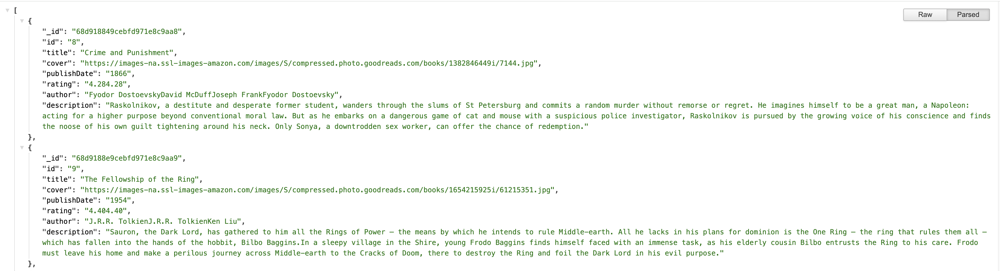
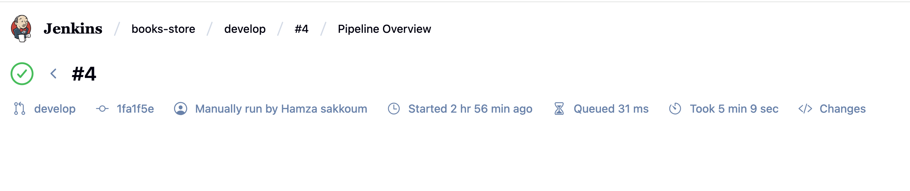
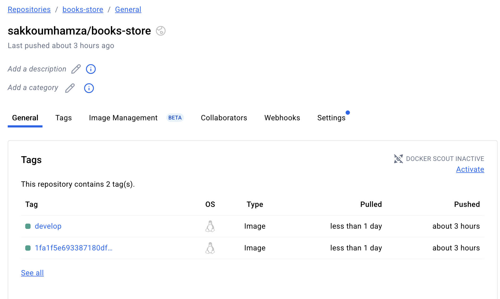

# 📚 Book Store Microservice

**Book Store** is a Node.js microservice that reads book data from **MongoDB** and exposes RESTful endpoints. The project is tested using **Jest** and linted using **ESLint**.  

It also includes a fully automated **CI/CD pipeline** using **Jenkins** and **Docker**, which:

- Pulls the latest code from GitHub  
- Installs dependencies and runs **ESLint** for code quality  
- Runs **Jest tests** and generates coverage reports  
- Builds a **Docker image** for the application  
- Pushes the Docker image to **Docker Hub** (tagged by commit SHA and branch)  

This setup ensures **continuous integration, automated testing, and containerized deployment** for a reliable and maintainable microservice architecture.

## 📂 Project Structure

```text
BOOKS-STORE/
├── .vscode/               # VSCode workspace settings
├── coverage/              # Jest coverage reports
├── node_modules/          # Node.js dependencies
├── test/                  # Test files
│   ├── books.json         # Sample book data for tests
│   └── dao.spec.js        # DAO unit tests
├── .env                   # Environment variables
├── .gitignore             # Git ignore rules
├── dao.js                 # Data Access Object for MongoDB
├── Dockerfile             # Dockerfile for production
├── Dockerfile.test        # Dockerfile for testing
├── eslint.config.js       # ESLint configuration
├── index.js               # Entry point for the microservice
├── Jenkinsfile            # CI/CD pipeline definition
├── jest.config.js         # Jest configuration
├── package.json           # Node.js project configuration
├── package-lock.json      # Node.js dependency lock
└── README.md              # Project documentation
```
---
## 🧑🏽‍💻 Pre-requisites

- node >= 20
- MongoDB server (or via Docker Compose)
- Docker & DockerHub account
- Jenkins for CI/CD pipeline with Docker Hub credentials set 

---

## CI/CD (Jenkins + DockerHub)

1. Checkout – Pull the latest code from GitHub

2. Install Dependencies – npm install

3. Run Lint – ESLint checks

4. Run Tests – Jest tests with coverage reports

5. Build Docker Image – Build the container image

6. Push to Docker Hub – Tag & push the image
---

## 📸 Screenshots

### 🔹 /books endpoint exmample


### 🔹 Jenkins 


### 🔹 Docker Hub image repository


## Installation
**Clone the repository:**
```bash
git clone https://github.com/sakkoumhamza/books-store-microservice.git
cd books-store-microservice
```
**Start mongodb**
```bash
// start using local or via docker compose
```
**Run the service**
```bash
npm start
```

---
## 🐳 Docker Setup

**Build the image**

```bash
docker build -t yourdockerhubusername/books-store:latest .
```

 **Run the container**

```bash
docker run yourdockerhubusername/books-store:latest
```

## 🫂 Contributing
``` text
1. Fork the repository

2. Create a feature branch (git checkout -b feature/new-feature)

3. Commit your changes (git commit -m 'Add new feature')

4. Push to your branch (git push origin feature/new-feature)

5. Open a Pull Request
```
 